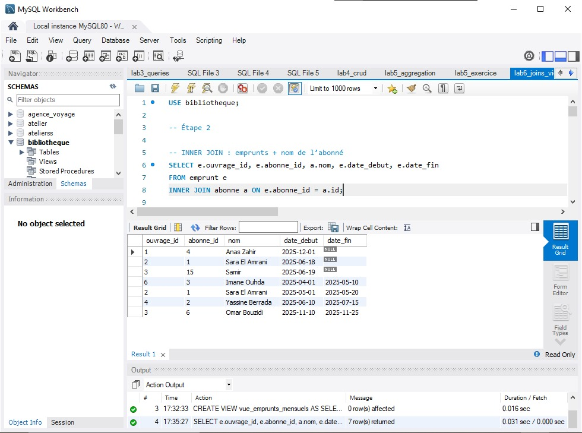
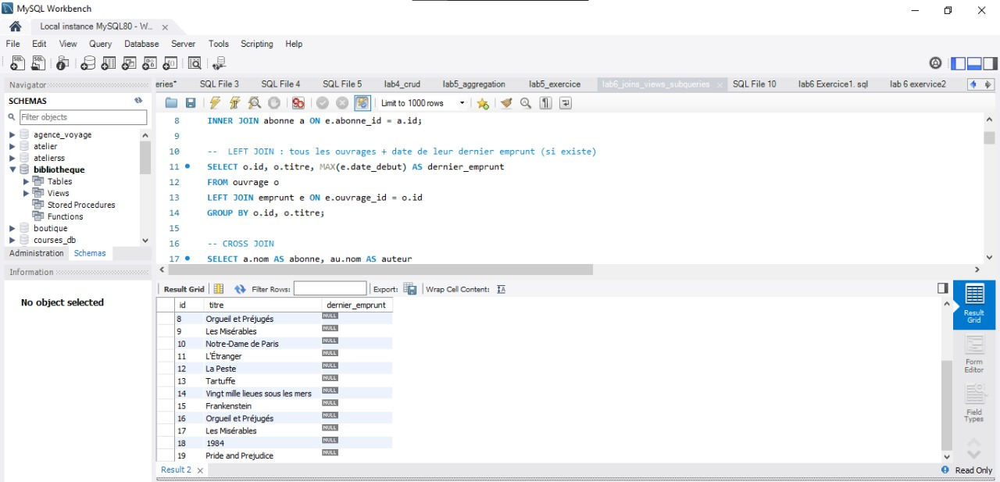
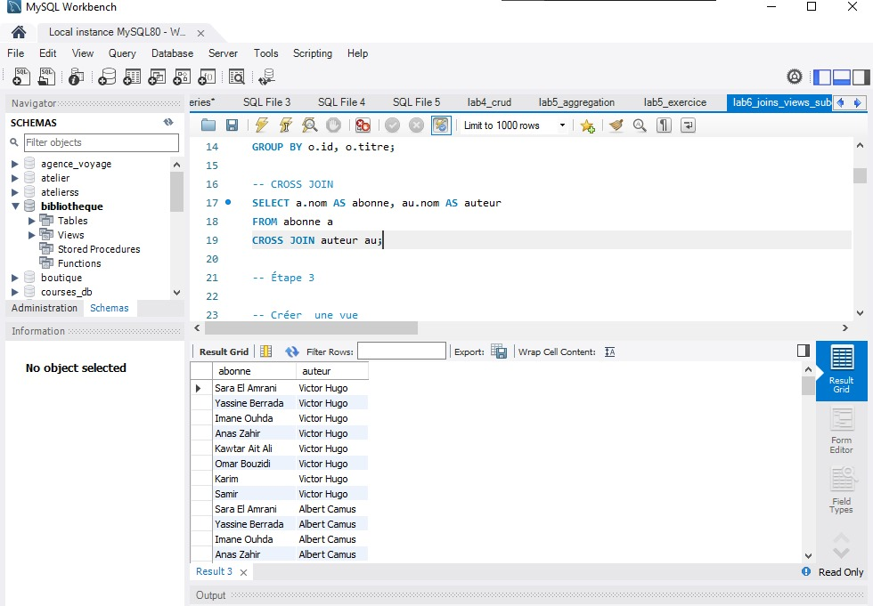
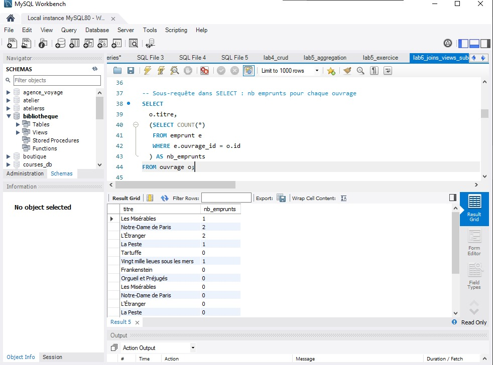
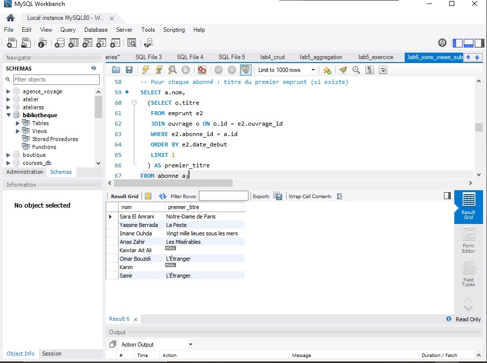
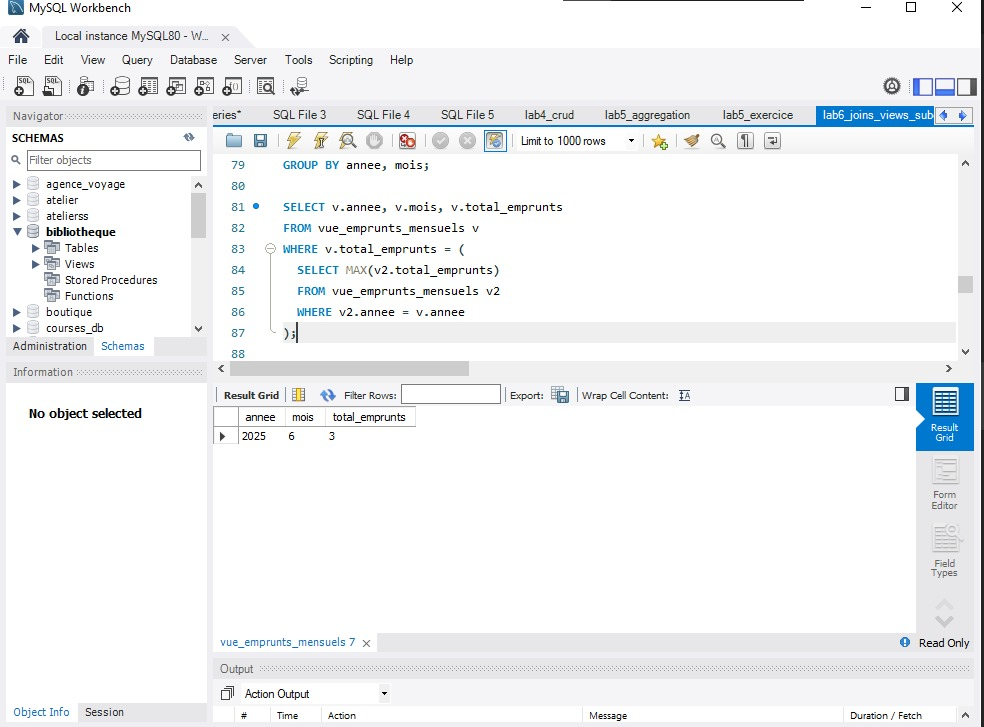

# Lab 6 : Jointures, vues et sous-requêtes

## 🎯 Objectif
Maîtriser :
- les jointures (INNER, LEFT, RIGHT, CROSS)
- les vues (CREATE VIEW)
- les sous-requêtes (simples et corrélées)
- les CTE (WITH)

## ✅ Prérequis
- Base `universite` déjà créée
- Tables : `etudiant`, `professeur`, `cours`, `enseignement`, `inscription`, `examen`

## 📁 Livrable
- `exercice_jointures.sql` : contient toutes les requêtes + création de la vue + CTE, avec commentaires SQL (`--`).

## ▶️ Exécution
Dans MySQL Workbench : ouvrir `exercice_jointures.sql` puis exécuter (⚡).
Ou en ligne de commande :
```bash
mysql -u root -p universite < exercice_jointures.sql
````

#### Résultat visuel

<div align="center">  <p><em>Figure 1</em></p> </div>


<div align="center">  <p><em>Figure 2</em></p> </div>


<div align="center">  <p><em>Figure 3</em></p> </div>


<div align="center">  <p><em>Figure 4</em></p> </div>


<div align="center">  <p><em>Figure 5</em></p> </div>


<div align="center">  <p><em>Figure 6</em></p> </div>


<div align="center">  <p><em>Figure 13</em></p> </div>
